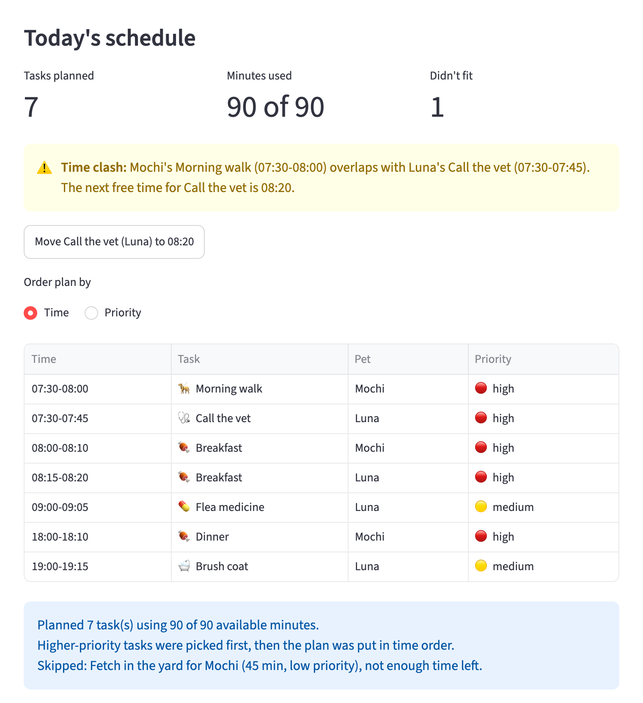
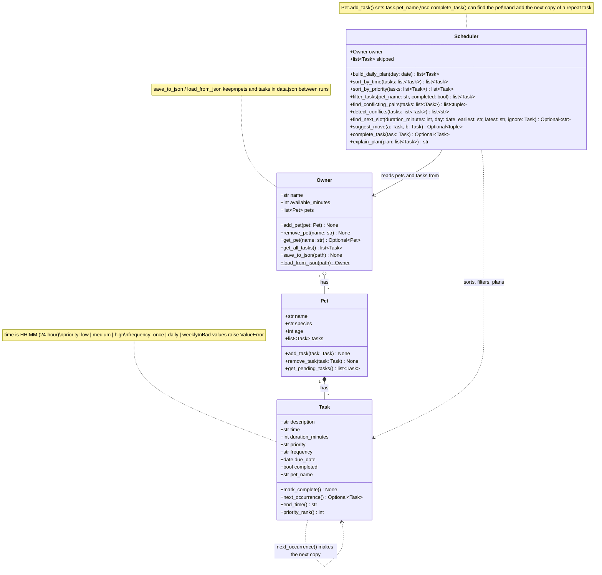
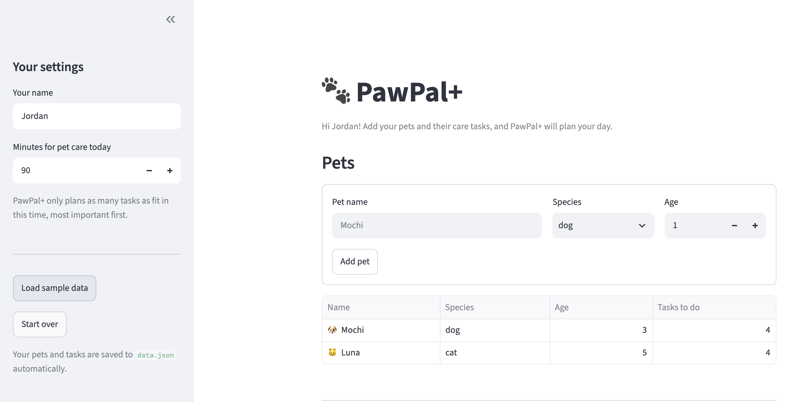
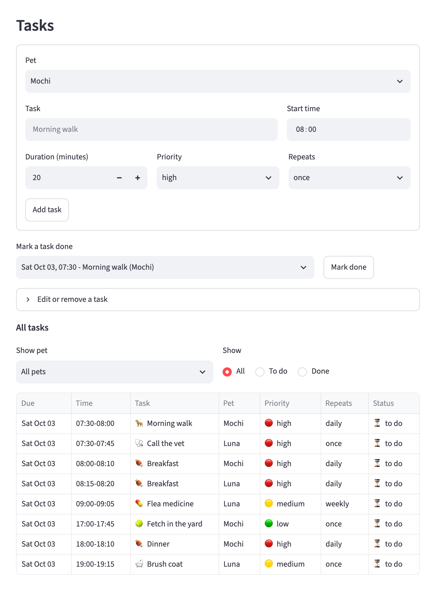
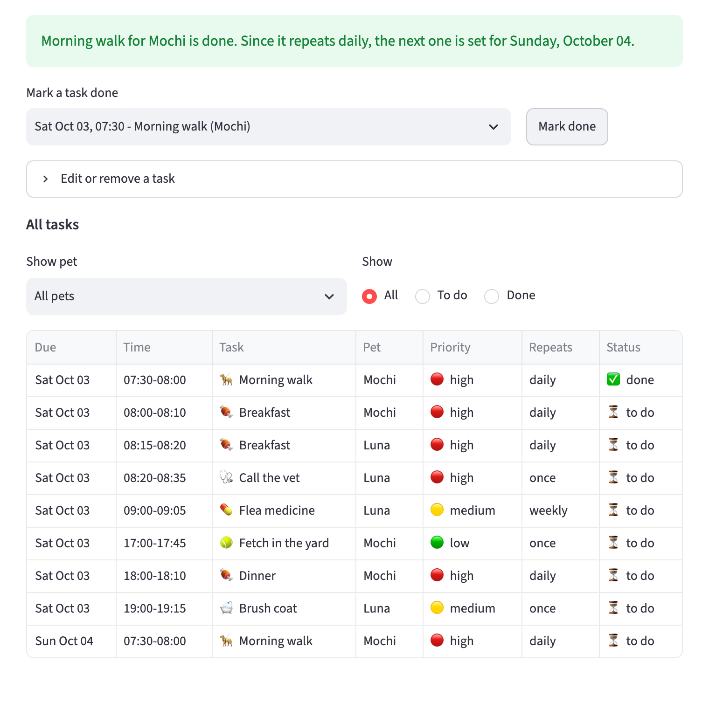
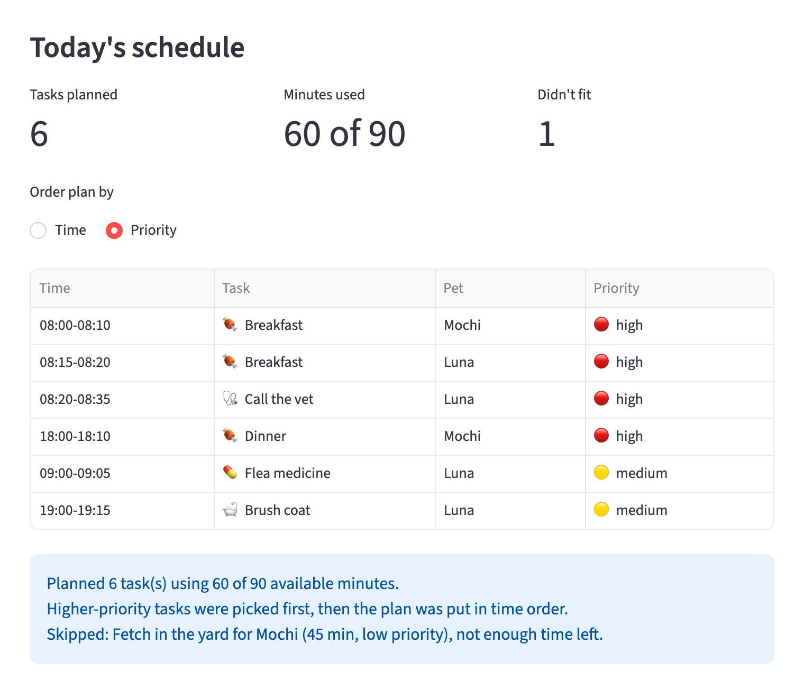

# 🐾 PawPal+

PawPal+ is a Streamlit app that helps a busy pet owner plan a day of pet care. You add your pets and their tasks (walks, feeding, meds, grooming), tell it how much time you have, and it builds a plan for today. The most important tasks go in first, everything is shown in time order, overlapping tasks get a warning with a one-click fix, and the app explains anything that didn't fit. Your pets and tasks are saved automatically, so they're still there next time.

The scheduling "brain" lives in plain Python classes (`pawpal_system.py`), so the same logic powers the Streamlit app, a command-line demo, and the test suite.



## Features

- **A daily plan that fits your time.** Tell PawPal+ how many minutes you have, and it picks tasks by priority until the time runs out. High-priority things like meds and feeding always go in first.
- **Sorting by time.** No matter what order you add tasks in, the plan and the task list are shown in the order they happen, by date and then by start time.
- **Priority view.** Flip the plan to priority order (high, then medium, then low, with earlier tasks first on a tie) to see exactly how PawPal+ chose what to keep.
- **Conflict warnings with a fix.** If two tasks overlap, even partly, PawPal+ names both tasks, both pets, and their times. It also finds the next free time for the lower-priority task and gives you a button to move it there.
- **Next free slot.** The scheduler can find the earliest open time in the day for a task of any length, skipping over everything already planned.
- **Daily and weekly repeats.** Mark a daily task done and a fresh copy shows up for tomorrow. Weekly tasks come back in 7 days, and one-time tasks just stay done.
- **Edit or remove tasks.** Change a task's name, time, length, priority, or how often it repeats, or delete it. Edits go through the same input checks as new tasks.
- **Filtering.** View the task list for one pet, only what's left to do, only what's done, or any mix.
- **Saved automatically.** Everything is saved to `data.json` after every change and loaded back when the app starts.
- **Easy to read at a glance.** Each task gets an emoji for its type (🦮 walks, 🍖 meals, 💊 meds, 🩺 vet, 🛁 grooming, 🎾 play), priorities are color-coded (🔴 high, 🟡 medium, 🟢 low), and status shows as ✅ done or ⏳ to do. The command-line demo prints neat tables using `tabulate`.
- **A plain-English explanation.** Every plan comes with a short summary: how many minutes it uses, how it chose tasks, and which tasks were skipped and why.
- **Friendly input checks.** In the app, a blank name or a second pet with the same name gets a clear message instead of a crash. Underneath, the classes also reject impossible values like a 25:00 start time or a priority of "urgent".

## Getting started

### Setup

```bash
python -m venv .venv
source .venv/bin/activate  # Windows: .venv\Scripts\activate
pip install -r requirements.txt
```

### Run it

| What                  | Command                                                 |
| --------------------- | ------------------------------------------------------- |
| The Streamlit app     | `streamlit run app.py` (opens at http://localhost:8501) |
| The command-line demo | `python main.py`                                        |
| The tests             | `python -m pytest`                                      |

### Project files

| File                     | What it's for                                                                                                                 |
| ------------------------ | ----------------------------------------------------------------------------------------------------------------------------- |
| `pawpal_system.py`       | The logic layer: the `Task`, `Pet`, `Owner`, and `Scheduler` classes, including saving and loading                            |
| `app.py`                 | The Streamlit app, which only talks to the classes above                                                                      |
| `main.py`                | A command-line demo that shows off every feature (it also supplies the app's sample data)                                     |
| `display.py`             | Emojis and color badges shared by the app and the demo                                                                        |
| `tests/`                 | 47 automated tests: the logic (`test_pawpal.py`), the display helpers (`test_display.py`), and the app itself (`test_app.py`) |
| `diagrams/uml_final.mmd` | The final class diagram (`diagrams/uml.mmd` is the same diagram)                                                              |
| `screenshots/`           | Screenshots of the app used in this README                                                                                    |
| `data.json`              | Your saved pets and tasks. Created by the app, and left out of git on purpose                                                 |
| `reflection.md`          | My notes on design choices, tradeoffs, testing, and working with AI                                                           |
| `ai_interactions.md`     | The agent workflow log and the two-model prompt comparison                                                                    |

## Smarter Scheduling

These are the parts of the `Scheduler` (and `Task`) that make the plan smarter than a plain to-do list. All of them live in `pawpal_system.py`.

| Feature                   | Method(s)                                                            | Notes                                                                                                                                                                                                                                                      |
| ------------------------- | -------------------------------------------------------------------- | ---------------------------------------------------------------------------------------------------------------------------------------------------------------------------------------------------------------------------------------------------------- |
| Task sorting              | `Scheduler.sort_by_time()`                                           | Orders tasks by due date, then start time, using `sorted()` with a lambda key.                                                                                                                                                                             |
| Priority-based scheduling | `Scheduler.sort_by_priority()`                                       | Sorts by priority first (high, medium, low), then by start time. `build_daily_plan()` picks tasks in this order, and the app can show the plan this way.                                                                                                   |
| Daily plan                | `Scheduler.build_daily_plan()`, `Scheduler.explain_plan()`           | Picks today's unfinished tasks by priority until the owner's available minutes run out, then puts the plan in time order. Anything that doesn't fit goes in `scheduler.skipped`, and the explanation says why.                                             |
| Filtering                 | `Scheduler.filter_tasks(pet_name=..., completed=...)`                | Shows one pet's tasks, only finished or unfinished tasks, or both at once. Leave an argument out to skip that filter.                                                                                                                                      |
| Conflict handling         | `Scheduler.find_conflicting_pairs()`, `Scheduler.detect_conflicts()` | Flags any two tasks on the same day whose time ranges overlap, not just exact matches. It returns warning messages instead of raising errors, so the app keeps running and the owner decides what to move.                                                 |
| Next available slot       | `Scheduler.find_next_slot()`, `Scheduler.suggest_move()`             | Walks the day's tasks in time order, tracking when the last busy stretch ends, and returns the first gap that's long enough. `suggest_move()` uses it to pick a new time for the lower-priority task in a clash.                                           |
| Recurring tasks           | `Scheduler.complete_task()`, `Task.next_occurrence()`                | Marking a daily or weekly task done adds a fresh copy for tomorrow or next week, using `timedelta`. A late task comes back starting from today, so it never lands on a date that's already gone. Marking the same task done twice doesn't make duplicates. |

## System Design

PawPal+ has four classes. An `Owner` has `Pet`s, each `Pet` has `Task`s, and the `Scheduler` reads everything from the `Owner` to build the plan. The Streamlit app and the demo script only call these classes. All the logic lives in `pawpal_system.py`.



The source for this diagram is in `diagrams/uml_final.mmd`.

## Sample Output

Here's what `python main.py` prints. The demo owner has two pets, eight tasks, and 90 minutes for pet care. The tasks are added out of order on purpose, and two of them start at 07:30, so you can see the sorting and the conflict warning:

```
Today's Schedule for Jordan (Saturday, October 03)
==================================================
╭─────────────┬──────────────────┬───────┬────────────┬──────────╮
│ Time        │ Task             │ Pet   │ Priority   │ Status   │
├─────────────┼──────────────────┼───────┼────────────┼──────────┤
│ 07:30-08:00 │ 🦮 Morning walk  │ Mochi │ 🔴 high    │ ⏳ to do │
│ 07:30-07:45 │ 🩺 Call the vet  │ Luna  │ 🔴 high    │ ⏳ to do │
│ 08:00-08:10 │ 🍖 Breakfast     │ Mochi │ 🔴 high    │ ⏳ to do │
│ 08:15-08:20 │ 🍖 Breakfast     │ Luna  │ 🔴 high    │ ⏳ to do │
│ 09:00-09:05 │ 💊 Flea medicine │ Luna  │ 🟡 medium  │ ⏳ to do │
│ 18:00-18:10 │ 🍖 Dinner        │ Mochi │ 🔴 high    │ ⏳ to do │
│ 19:00-19:15 │ 🛁 Brush coat    │ Luna  │ 🟡 medium  │ ⏳ to do │
╰─────────────┴──────────────────┴───────┴────────────┴──────────╯
Planned 7 task(s) using 90 of 90 available minutes.
Higher-priority tasks were picked first, then the plan was put in time order.
Skipped: Fetch in the yard for Mochi (45 min, low priority), not enough time left.

All of today's tasks, by priority then time
===========================================
╭─────────────┬──────────────────────┬───────┬────────────┬──────────╮
│ Time        │ Task                 │ Pet   │ Priority   │ Status   │
├─────────────┼──────────────────────┼───────┼────────────┼──────────┤
│ 07:30-08:00 │ 🦮 Morning walk      │ Mochi │ 🔴 high    │ ⏳ to do │
│ 07:30-07:45 │ 🩺 Call the vet      │ Luna  │ 🔴 high    │ ⏳ to do │
│ 08:00-08:10 │ 🍖 Breakfast         │ Mochi │ 🔴 high    │ ⏳ to do │
│ 08:15-08:20 │ 🍖 Breakfast         │ Luna  │ 🔴 high    │ ⏳ to do │
│ 18:00-18:10 │ 🍖 Dinner            │ Mochi │ 🔴 high    │ ⏳ to do │
│ 09:00-09:05 │ 💊 Flea medicine     │ Luna  │ 🟡 medium  │ ⏳ to do │
│ 19:00-19:15 │ 🛁 Brush coat        │ Luna  │ 🟡 medium  │ ⏳ to do │
│ 17:00-17:45 │ 🎾 Fetch in the yard │ Mochi │ 🟢 low     │ ⏳ to do │
╰─────────────┴──────────────────────┴───────┴────────────┴──────────╯

Conflict check
==============
⚠️  WARNING: Mochi's Morning walk (07:30-08:00) overlaps with Luna's Call the vet (07:30-07:45).
   Suggestion: move Luna's Call the vet to 08:20, the next free time.

Next free slot after 07:30
==========================
A 20-minute task fits at: 08:20
A 60-minute task fits at: 09:05

Recurring tasks
===============
✅ Morning walk (Mochi, daily) -> next one added for Sun Oct 04
✅ Flea medicine (Luna, weekly) -> next one added for Sat Oct 10
✅ Call the vet (Luna, once) -> doesn't repeat, nothing added

Filter: Mochi's tasks
=====================
╭────────────┬─────────────┬──────────────────────┬───────┬────────────┬──────────╮
│ Date       │ Time        │ Task                 │ Pet   │ Priority   │ Status   │
├────────────┼─────────────┼──────────────────────┼───────┼────────────┼──────────┤
│ Sat Oct 03 │ 07:30-08:00 │ 🦮 Morning walk      │ Mochi │ 🔴 high    │ ✅ done  │
│ Sat Oct 03 │ 08:00-08:10 │ 🍖 Breakfast         │ Mochi │ 🔴 high    │ ⏳ to do │
│ Sat Oct 03 │ 17:00-17:45 │ 🎾 Fetch in the yard │ Mochi │ 🟢 low     │ ⏳ to do │
│ Sat Oct 03 │ 18:00-18:10 │ 🍖 Dinner            │ Mochi │ 🔴 high    │ ⏳ to do │
│ Sun Oct 04 │ 07:30-08:00 │ 🦮 Morning walk      │ Mochi │ 🔴 high    │ ⏳ to do │
╰────────────┴─────────────┴──────────────────────┴───────┴────────────┴──────────╯

Filter: finished tasks
======================
╭────────────┬─────────────┬──────────────────┬───────┬────────────┬──────────╮
│ Date       │ Time        │ Task             │ Pet   │ Priority   │ Status   │
├────────────┼─────────────┼──────────────────┼───────┼────────────┼──────────┤
│ Sat Oct 03 │ 07:30-08:00 │ 🦮 Morning walk  │ Mochi │ 🔴 high    │ ✅ done  │
│ Sat Oct 03 │ 07:30-07:45 │ 🩺 Call the vet  │ Luna  │ 🔴 high    │ ✅ done  │
│ Sat Oct 03 │ 09:00-09:05 │ 💊 Flea medicine │ Luna  │ 🟡 medium  │ ✅ done  │
╰────────────┴─────────────┴──────────────────┴───────┴────────────┴──────────╯
```

A few things to notice:

- The plan uses all 90 minutes. The 45-minute fetch session was the only low-priority task, so it was picked last and didn't fit. The scheduler skipped it and said why.
- In the priority table, Dinner (18:00, high) comes before Flea medicine (09:00, medium), and Brush coat (19:00, medium) comes before Fetch (17:00, low). Priority wins first, and time only breaks ties.
- The walk and the vet call both start at 07:30, so the conflict check flags them. Both are high priority, so the later-listed vet call is the one to move. Its next free time is 08:20, right after both breakfasts. Breakfast at 08:00 isn't flagged, because the walk ends right as it starts.
- From 07:30 on, a 20-minute task first fits at 08:20. A 60-minute task doesn't fit in the 08:20-09:00 gap, so it goes to 09:05, right after the flea medicine.
- Finishing the daily walk adds a new walk for tomorrow, and finishing the weekly flea medicine adds one for next week. The one-time vet call just gets marked done.

## Testing PawPal+

Run the tests from the project folder (with the virtual environment turned on):

```bash
python -m pytest
```

Add `-v` to see the name of every test.

### What the tests cover

There are 47 tests in three files. They check both the normal "everything works" path and the tricky edge cases:

- **Sorting:** tasks come back in time order, earlier days come before later days, and high priority comes first (with the earlier task winning a tie).
- **Daily plan:** the plan fits in the owner's available minutes, lower-priority tasks get skipped (and the explanation says so), finished tasks and tasks for other days are left out, and a pet with no tasks gives an empty plan instead of an error.
- **Recurring tasks:** finishing a daily task creates one for tomorrow, and a weekly task creates one for next week. A one-time task doesn't come back. Finishing the same task twice doesn't make duplicates, and a task finished late comes back tomorrow, not on a date that has already passed.
- **Conflict detection:** two tasks at the exact same time get flagged, and so do partly overlapping ones. Back-to-back tasks (one ends at 8:00, the next starts at 8:00) and tasks at the same time on different days don't. A long task that runs into two later tasks gets flagged for both.
- **Next free slot:** finds the first gap that's long enough, handles busy times that overlap each other, ignores finished tasks and other days, returns nothing when the day is full, and suggests moving the lower-priority task in a clash.
- **Saving and loading:** a save-then-load round trip gives back exactly the same pets and tasks (dates, done status, and all), and a hand-edited file with a bad value is rejected instead of loaded.
- **Filtering and basics:** filtering by pet, by done/not done, and both at once, plus input checks (bad priority, bad time, 0-minute tasks, two pets with the same name).
- **Display helpers:** each task gets the right emoji (and "brunch" doesn't count as a walk just because it contains "run"), and badges show the right color and status.
- **The app itself:** loading sample data shows the clash warning, the "Move" button fixes it, marking a task done shows a clean message, and saved data comes back after a restart.

To make sure the tests actually catch bugs, I broke the code on purpose in several ways, like letting back-to-back tasks count as conflicts, removing the double-click guard, and bringing back an old app bug that printed junk under the "done" message. Each time, the matching test failed.

### Sample test output

```
============================= test session starts ==============================
platform darwin -- Python 3.11.14, pytest-9.1.1, pluggy-1.6.0
rootdir: /Users/Base/Desktop/Coding/ai110-module2show-pawpal-starter
configfile: pytest.ini
testpaths: tests
plugins: anyio-4.15.1
collected 47 items

tests/test_app.py ...                                                    [  6%]
tests/test_display.py .........                                          [ 25%]
tests/test_pawpal.py ...................................                 [100%]

============================== 47 passed in 0.75s ==============================
```

### Confidence level: ★★★★☆ (4 out of 5)

I'm confident in the scheduling logic and the main app flows. Every feature has tests for the normal case and the edge cases, the app has end-to-end tests, and the tests proved they can catch real mistakes. I'm holding back one star because there are still cases the scheduler doesn't handle, like a task that runs past midnight into the next day, and the app tests cover the main flows rather than every button.

## 🌟 Optional Extensions

I did all five optional challenges.

### 1. Advanced algorithm: next available slot

`Scheduler.find_next_slot()` finds the earliest time in a day when a task of a given length fits without overlapping anything unfinished. It sorts the day's tasks by start time and walks through them, keeping track of when the last busy stretch ends. As soon as it finds a gap that's long enough, it returns that time. Using "latest end so far" means tasks that overlap each other (like breakfast during a long hike) don't confuse it.

`Scheduler.suggest_move()` builds on this. For two clashing tasks, it picks the one to move (the lower priority, or the later one if they tie) and finds its next free time after its current start. In the app, each clash warning comes with a **Move ... to HH:MM** button. The agent workflow for this feature is written up in `ai_interactions.md`.

### 2. Data persistence

PawPal+ remembers your pets and tasks between runs.

**How it works:**

1. When the app starts for the first time in a session, it calls `Owner.load_from_json("data.json")`. If there's no file yet, it starts fresh. If the file can't be read, it shows a warning and starts fresh instead of crashing.
2. After every click, at the very end of `app.py`, it calls `owner.save_to_json("data.json")`. Every change (new pet, new task, edit, mark done, move) is on disk before the page finishes loading.
3. `save_to_json()` turns the owner, pets, and tasks into plain dictionaries with `dataclasses.asdict()` and writes dates as `"YYYY-MM-DD"`. It writes to a temp file first and then swaps it in, so a crash halfway through can't leave a broken file.
4. `load_from_json()` rebuilds everything through the normal `Pet` and `Task` constructors. A bad value in a hand-edited file (like a 25:00 start time) gets caught by the same input checks as the app.

I used a custom dictionary conversion instead of a library like `marshmallow`, because `asdict()` already handles the nested dataclasses and only the dates needed special care.

**Files changed:** `pawpal_system.py` (the two new methods), `app.py` (load on start, save after every run, a warning for unreadable files), `.gitignore` (keeps `data.json` out of git), and `tests/` (round-trip, bad-file, and restart tests).

### 3. Advanced priority scheduling

Tasks have a priority (low, medium, high). `Scheduler.sort_by_priority()` sorts by priority first and then by start time, and `build_daily_plan()` uses that order to decide what fits. In the app, **Order plan by** switches the schedule between time order and priority order. Here's the command-line version, listing all of today's tasks in the order the scheduler considers them:

```
All of today's tasks, by priority then time
===========================================
╭─────────────┬──────────────────────┬───────┬────────────┬──────────╮
│ Time        │ Task                 │ Pet   │ Priority   │ Status   │
├─────────────┼──────────────────────┼───────┼────────────┼──────────┤
│ 07:30-08:00 │ 🦮 Morning walk      │ Mochi │ 🔴 high    │ ⏳ to do │
│ 07:30-07:45 │ 🩺 Call the vet      │ Luna  │ 🔴 high    │ ⏳ to do │
│ 08:00-08:10 │ 🍖 Breakfast         │ Mochi │ 🔴 high    │ ⏳ to do │
│ 08:15-08:20 │ 🍖 Breakfast         │ Luna  │ 🔴 high    │ ⏳ to do │
│ 18:00-18:10 │ 🍖 Dinner            │ Mochi │ 🔴 high    │ ⏳ to do │
│ 09:00-09:05 │ 💊 Flea medicine     │ Luna  │ 🟡 medium  │ ⏳ to do │
│ 19:00-19:15 │ 🛁 Brush coat        │ Luna  │ 🟡 medium  │ ⏳ to do │
│ 17:00-17:45 │ 🎾 Fetch in the yard │ Mochi │ 🟢 low     │ ⏳ to do │
╰─────────────┴──────────────────────┴───────┴────────────┴──────────╯
```

Dinner at 18:00 comes ahead of the 09:00 flea medicine because it's high priority. Fetch is last because it's the only low-priority task, which is exactly why it was the one skipped when time ran out.

### 4. Professional UI and output formatting

- **Emojis by task type:** `display.task_emoji()` matches words in the description (🦮 walk/hike, 🍖 meals and treats, 💊 meds, 🩺 vet, 🛁 grooming, 🎾 play, 🐾 anything else). It matches on whole-word starts, so "medicine" counts as meds but "brunch" doesn't count as a run.
- **Color-coded status:** `display.priority_badge()` shows 🔴 high, 🟡 medium, 🟢 low, and `display.status_badge()` shows ✅ done or ⏳ to do. Pets get 🐶 or 🐱 in the app.
- **CLI tables:** `main.py` prints every table with `tabulate` (the `rounded_outline` style). `wcwidth` is installed too, so emojis don't throw off the column widths.
- **In the app:** the same badges appear in every table, clash warnings use `st.warning`, confirmations use `st.success`, and the summary numbers use `st.metric`.

Libraries added: `tabulate` and `wcwidth` (see `requirements.txt`).

### 5. Multi-model prompt comparison

I gave the same prompt (write `next_occurrence()` for recurring tasks) to two models, Claude Haiku and Claude Sonnet, then ran both answers against the same edge cases. The full comparison and my decision are in `ai_interactions.md`.

## 📸 Demo Walkthrough

### What you can do in the app

- **Sidebar:** set your name and how many minutes you have for pet care today. **Load sample data** fills in two pets and eight tasks so you can try everything right away. **Start over** clears it all. Everything saves to `data.json` automatically.
- **Pets:** add a pet with a name, species, and age. The table shows each pet and how many tasks it still has to do.
- **Tasks:** add a task for a pet with a description, start time, duration, priority, and how often it repeats. Use **Mark a task done** to finish one, open **Edit or remove a task** to change or delete one, and filter the full task list by pet or by status.
- **Today's schedule:** updates by itself as you make changes. It shows a quick summary (tasks planned, minutes used, tasks that didn't fit), time-clash warnings with a button to move a task to the next free time, the plan (in time or priority order), and an explanation.

### Example workflow

1. **Start the app** with `streamlit run app.py`. The first time, the page opens with empty Pets, Tasks, and Today's schedule sections, each with a hint about what to do first.
2. **Set your time.** In the sidebar, change "Minutes for pet care today" to 90.
3. **Add a pet.** Type "Mochi", pick "dog", set the age to 3, and click **Add pet**. A green message confirms it, and Mochi shows up in the Pets table. Adding a second "Mochi" shows a red error instead.
4. **Schedule a task.** In the Tasks form, pick Mochi, type "Morning walk", set the start time to 07:30, the duration to 30, priority "high", and repeats "daily", then click **Add task**. Add a few more tasks in any order you like. The "All tasks" table always lists them by date and time, with an emoji for each task type.
5. **View today's schedule.** Scroll down. PawPal+ picks the highest-priority tasks first until your 90 minutes are used up, then shows the plan in time order. Switch **Order plan by** to Priority to see the order it picked them in. If something didn't fit, a blue box explains what was skipped and why. If everything fit, the box is green.
6. **See a conflict and fix it.** Click **Load sample data** in the sidebar (this replaces what you've entered). Mochi's walk and Luna's vet call both start at 07:30, so a yellow "Time clash" warning appears, saying the next free time for the vet call is 08:20. Click **Move Call the vet (Luna) to 08:20** and the warning goes away. (Load the sample data again to bring the clash back for the next steps.)
7. **Mark a task done.** Under Tasks, pick "Morning walk (Mochi)" in **Mark a task done** and click **Mark done**. The message says the next walk is set for tomorrow. The walk drops out of today's schedule, the clash warning goes away, and the task list now shows tomorrow's walk.
8. **Edit a task.** Open **Edit or remove a task**, pick "Brush coat (Luna)", change the start time to 07:40, and click **Save changes**. The schedule moves it into the morning, and a new clash warning shows up because it now overlaps Luna's 07:30 vet call. This time it suggests 07:45 for the brushing, which fits exactly before Mochi's 08:00 breakfast. **Remove task** deletes a task instead.
9. **Filter the list.** Set "Show pet" to Mochi and "Show" to Done to see only Mochi's finished tasks.
10. **Restart the app.** Stop it (Ctrl+C) and run `streamlit run app.py` again. Your pets and tasks are still there, loaded from `data.json`.

### Screenshots

These were taken from the running app after clicking **Load sample data**.

**1. Your settings and pets.** The sidebar holds your name, your time for the day, and the sample data and start-over buttons. Each pet shows how many tasks it still has to do.



**2. Tasks.** Add a task, mark one done, edit or remove one, and filter the list. Every task gets an emoji for its type, a color-coded priority, and a status. The list is always in date and time order, even though the sample tasks were added out of order.



**3. Today's schedule with a clash (step 6).** The plan uses all 90 minutes and explains why Fetch didn't fit. The walk and the vet call overlap, so there's a warning with the next free time and a button to move the vet call there.


**4. Marking a daily task done (step 7).** After the clash is fixed, marking the morning walk done shows a confirmation, the walk turns ✅ done, and a fresh walk for tomorrow appears at the bottom of the list.



**5. The fixed plan in priority order (step 5).** The vet call now sits at 08:20, so there are no clashes left. With **Order plan by** set to Priority, all high-priority tasks come first (including 18:00 Dinner), then the medium ones.



### Scheduler behaviors you'll see

| In the app                                                                         | Scheduler method behind it                        |
| ---------------------------------------------------------------------------------- | ------------------------------------------------- |
| Task list and plan always in time order                                            | `sort_by_time()`                                  |
| High-priority tasks picked first when time is short, and the "Priority" plan order | `sort_by_priority()` inside `build_daily_plan()`  |
| "Didn't fit" count and the blue explanation box                                    | `build_daily_plan()` + `explain_plan()`           |
| Yellow "Time clash" warnings                                                       | `find_conflicting_pairs()` + `detect_conflicts()` |
| "Move ... to HH:MM" buttons                                                        | `suggest_move()` + `find_next_slot()`             |
| "Show pet" and "Show" filters                                                      | `filter_tasks()`                                  |
| "Mark done" bringing back tomorrow's task                                          | `complete_task()` + `Task.next_occurrence()`      |
| Data still there after a restart                                                   | `Owner.save_to_json()` + `Owner.load_from_json()` |

### The same features from the command line

`python main.py` runs the same scheduler on the sample data. Here's the schedule and the conflict check from its output (the full output is in the Sample Output section above):

```
Today's Schedule for Jordan (Saturday, October 03)
==================================================
╭─────────────┬──────────────────┬───────┬────────────┬──────────╮
│ Time        │ Task             │ Pet   │ Priority   │ Status   │
├─────────────┼──────────────────┼───────┼────────────┼──────────┤
│ 07:30-08:00 │ 🦮 Morning walk  │ Mochi │ 🔴 high    │ ⏳ to do │
│ 07:30-07:45 │ 🩺 Call the vet  │ Luna  │ 🔴 high    │ ⏳ to do │
│ 08:00-08:10 │ 🍖 Breakfast     │ Mochi │ 🔴 high    │ ⏳ to do │
│ 08:15-08:20 │ 🍖 Breakfast     │ Luna  │ 🔴 high    │ ⏳ to do │
│ 09:00-09:05 │ 💊 Flea medicine │ Luna  │ 🟡 medium  │ ⏳ to do │
│ 18:00-18:10 │ 🍖 Dinner        │ Mochi │ 🔴 high    │ ⏳ to do │
│ 19:00-19:15 │ 🛁 Brush coat    │ Luna  │ 🟡 medium  │ ⏳ to do │
╰─────────────┴──────────────────┴───────┴────────────┴──────────╯
Planned 7 task(s) using 90 of 90 available minutes.
Higher-priority tasks were picked first, then the plan was put in time order.
Skipped: Fetch in the yard for Mochi (45 min, low priority), not enough time left.

Conflict check
==============
⚠️  WARNING: Mochi's Morning walk (07:30-08:00) overlaps with Luna's Call the vet (07:30-07:45).
   Suggestion: move Luna's Call the vet to 08:20, the next free time.

Next free slot after 07:30
==========================
A 20-minute task fits at: 08:20
A 60-minute task fits at: 09:05
```
