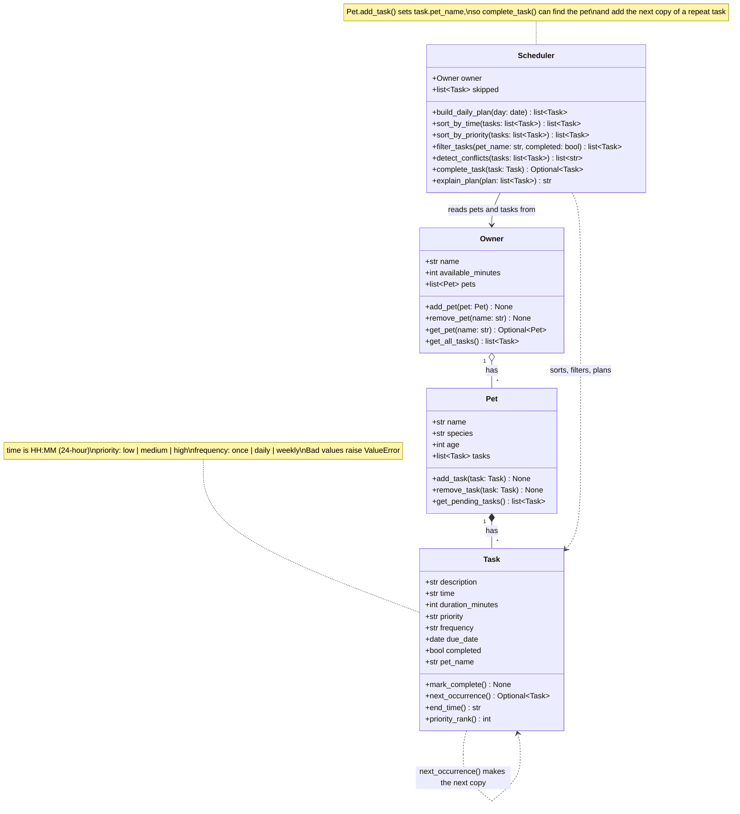

# 🐾 PawPal+

PawPal+ is a Streamlit app that helps a busy pet owner plan a day of pet care. You add your pets and their tasks (walks, feeding, meds, grooming), tell it how much time you have, and it builds a plan for today. The most important tasks go in first, everything is shown in time order, overlapping tasks get a warning, and the app explains anything that didn't fit.

The scheduling "brain" lives in plain Python classes (`pawpal_system.py`), so the same logic powers the Streamlit app, a command-line demo, and the test suite.

## ✨ Features

- **A daily plan that fits your time.** Tell PawPal+ how many minutes you have, and it picks tasks by priority until the time runs out. High-priority things like meds and feeding always go in first.
- **Sorting by time.** No matter what order you add tasks in, the plan and the task list are shown in the order they happen, by date and then by start time.
- **Conflict warnings.** If two tasks overlap, even partly, PawPal+ shows a warning that names both tasks, both pets, and their times. It warns instead of blocking, so you decide what to move.
- **Daily and weekly repeats.** Mark a daily task done and a fresh copy shows up for tomorrow. Weekly tasks come back in 7 days, and one-time tasks just stay done.
- **Edit or remove tasks.** Change a task's name, time, length, priority, or how often it repeats, or delete it. Edits go through the same input checks as new tasks.
- **Filtering.** View the task list for one pet, only what's left to do, only what's done, or any mix.
- **A plain-English explanation.** Every plan comes with a short summary: how many minutes it uses, how it chose tasks, and which tasks were skipped and why.
- **Friendly input checks.** In the app, a blank name or a second pet with the same name gets a clear message instead of a crash. Underneath, the classes also reject impossible values like a 25:00 start time or a priority of "urgent".

## 🚀 Getting started

### Setup

```bash
python -m venv .venv
source .venv/bin/activate  # Windows: .venv\Scripts\activate
pip install -r requirements.txt
```

### Run it

| What | Command |
|------|---------|
| The Streamlit app | `streamlit run app.py` (opens at http://localhost:8501) |
| The command-line demo | `python main.py` |
| The tests | `python -m pytest` |

### Project files

| File | What it's for |
|------|---------------|
| `pawpal_system.py` | The logic layer: the `Task`, `Pet`, `Owner`, and `Scheduler` classes |
| `app.py` | The Streamlit app, which only talks to the classes above |
| `main.py` | A command-line demo that shows off every feature (it also supplies the app's sample data) |
| `tests/test_pawpal.py` | 28 automated tests |
| `diagrams/uml_final.mmd` | The final class diagram (`diagrams/uml.mmd` is the same diagram) |
| `reflection.md` | My notes on design choices, tradeoffs, testing, and working with AI |

## 📐 Smarter Scheduling

These are the parts of the `Scheduler` (and `Task`) that make the plan smarter than a plain to-do list. All of them live in `pawpal_system.py`.

| Feature | Method(s) | Notes |
|---------|-----------|-------|
| Task sorting | `Scheduler.sort_by_time()`, `Scheduler.sort_by_priority()` | `sort_by_time()` orders tasks by due date, then start time, using `sorted()` with a lambda key. `sort_by_priority()` puts high before medium before low, with earlier tasks winning ties. |
| Daily plan | `Scheduler.build_daily_plan()`, `Scheduler.explain_plan()` | Picks today's unfinished tasks by priority until the owner's available minutes run out, then puts the plan in time order. Anything that doesn't fit goes in `scheduler.skipped`, and the explanation says why. |
| Filtering | `Scheduler.filter_tasks(pet_name=..., completed=...)` | Shows one pet's tasks, only finished or unfinished tasks, or both at once. Leave an argument out to skip that filter. |
| Conflict handling | `Scheduler.detect_conflicts()` | Flags any two tasks on the same day whose time ranges overlap, not just exact matches. It returns warning messages instead of raising errors, so the app keeps running and the owner decides what to move. |
| Recurring tasks | `Scheduler.complete_task()`, `Task.next_occurrence()` | Marking a daily or weekly task done adds a fresh copy for tomorrow or next week, using `timedelta`. A late task comes back starting from today, so it never lands on a date that's already gone. Marking the same task done twice doesn't make duplicates. |

## 🧩 System Design

PawPal+ has four classes. An `Owner` has `Pet`s, each `Pet` has `Task`s, and the `Scheduler` reads everything from the `Owner` to build the plan. The Streamlit app and the demo script only call these classes. All the logic lives in `pawpal_system.py`.



The source for this diagram is in `diagrams/uml_final.mmd`.

## 🖥️ Sample Output

Here's what `python main.py` prints. The demo owner has two pets, eight tasks, and 90 minutes for pet care. The tasks are added out of order on purpose, and two of them start at 07:30, so you can see the sorting and the conflict warning:

```
Today's Schedule for Jordan (Saturday, October 03)
----------------------------------------------------------------
07:30-08:00  Morning walk       Mochi  high
07:30-07:45  Call the vet       Luna   high
08:00-08:10  Breakfast          Mochi  high
08:15-08:20  Breakfast          Luna   high
09:00-09:05  Flea medicine      Luna   medium
19:00-19:15  Brush coat         Luna   medium
----------------------------------------------------------------
Planned 6 task(s) using 80 of 90 available minutes.
Higher-priority tasks were picked first, then the plan was put in time order.
Skipped: Fetch in the yard for Mochi (45 min, low priority), not enough time left.

Conflict check
----------------------------------------------------------------
WARNING: Mochi's Morning walk (07:30-08:00) overlaps with Luna's Call the vet (07:30-07:45).

Recurring tasks
----------------------------------------------------------------
Done: Morning walk (Mochi, daily) -> next one added for Sun Oct 04
Done: Flea medicine (Luna, weekly) -> next one added for Sat Oct 10
Done: Call the vet (Luna, once) -> doesn't repeat, nothing added

Filter: Mochi's tasks
----------------------------------------------------------------
Sat Oct 03  07:30-08:00  Morning walk       Mochi  high    done
Sat Oct 03  08:00-08:10  Breakfast          Mochi  high
Sat Oct 03  17:00-17:45  Fetch in the yard  Mochi  low
Sun Oct 04  07:30-08:00  Morning walk       Mochi  high

Filter: finished tasks
----------------------------------------------------------------
Sat Oct 03  07:30-08:00  Morning walk       Mochi  high    done
Sat Oct 03  07:30-07:45  Call the vet       Luna   high    done
Sat Oct 03  09:00-09:05  Flea medicine      Luna   medium  done
```

A few things to notice:

- The 45-minute fetch session was the only low-priority task, and it didn't fit in the 10 minutes left, so the scheduler skipped it and said why.
- The walk and the vet call both start at 07:30, so the conflict check flags them. Breakfast at 08:00 isn't flagged, because the walk ends right as it starts.
- Finishing the daily walk adds a new walk for tomorrow, and finishing the weekly flea medicine adds one for next week. The one-time vet call just gets marked done.

## 🧪 Testing PawPal+

Run the tests from the project folder (with the virtual environment turned on):

```bash
python -m pytest
```

Add `-v` to see the name of every test.

### What the tests cover

All 28 tests live in `tests/test_pawpal.py`. They check both the normal "everything works" path and the tricky edge cases:

- **Sorting:** tasks come back in time order, earlier days come before later days, and high priority comes first (with the earlier task winning a tie).
- **Daily plan:** the plan fits in the owner's available minutes, lower-priority tasks get skipped (and the explanation says so), finished tasks and tasks for other days are left out, and a pet with no tasks gives an empty plan instead of an error.
- **Recurring tasks:** finishing a daily task creates one for tomorrow, and a weekly task creates one for next week. A one-time task doesn't come back. Finishing the same task twice doesn't make duplicates, and a task finished late comes back tomorrow, not on a date that has already passed.
- **Conflict detection:** two tasks at the exact same time get flagged, and so do partly overlapping ones. Back-to-back tasks (one ends at 8:00, the next starts at 8:00) and tasks at the same time on different days don't. A long task that runs into two later tasks gets flagged for both.
- **Filtering and basics:** filtering by pet, by done/not done, and both at once, plus input checks (bad priority, bad time, 0-minute tasks, two pets with the same name).

To make sure the tests actually catch bugs, I broke the code on purpose in five ways, like letting back-to-back tasks count as conflicts or removing the double-click guard. Each time, the matching test failed.

### Sample test output

```
============================= test session starts ==============================
platform darwin -- Python 3.11.14, pytest-9.1.1, pluggy-1.6.0
rootdir: /Users/Base/Desktop/Coding/ai110-module2show-pawpal-starter
configfile: pytest.ini
testpaths: tests
plugins: anyio-4.15.1
collected 28 items

tests/test_pawpal.py ............................                        [100%]

============================== 28 passed in 0.01s ==============================
```

### Confidence level: ★★★★☆ (4 out of 5)

I'm confident in the scheduling logic. Every feature has tests for the normal case and the edge cases, and the tests proved they can catch real mistakes. I'm holding back one star for two reasons. The Streamlit app isn't covered by automated tests (I checked it by clicking through it), and there are cases the scheduler doesn't handle yet, like a task that runs past midnight into the next day.

## 📸 Demo Walkthrough

### What you can do in the app

- **Sidebar:** set your name and how many minutes you have for pet care today. **Load sample data** fills in two pets and eight tasks so you can try everything right away. **Start over** clears it all.
- **Pets:** add a pet with a name, species, and age. The table shows each pet and how many tasks it still has to do.
- **Tasks:** add a task for a pet with a description, start time, duration, priority, and how often it repeats. Use **Mark a task done** to finish one, open **Edit or remove a task** to change or delete one, and filter the full task list by pet or by status.
- **Today's schedule:** updates by itself as you make changes. It shows a quick summary (tasks planned, minutes used, tasks that didn't fit), any time-clash warnings, the plan in time order, and an explanation.

### Example workflow

1. **Start the app** with `streamlit run app.py`. The page opens with empty Pets, Tasks, and Today's schedule sections, each with a hint about what to do first.
2. **Set your time.** In the sidebar, change "Minutes for pet care today" to 90.
3. **Add a pet.** Type "Mochi", pick "dog", set the age to 3, and click **Add pet**. A green message confirms it, and Mochi shows up in the Pets table. Adding a second "Mochi" shows a red error instead.
4. **Schedule a task.** In the Tasks form, pick Mochi, type "Morning walk", set the start time to 07:30, the duration to 30, priority "high", and repeats "daily", then click **Add task**. Add a few more tasks in any order you like. The "All tasks" table always lists them by date and time.
5. **View today's schedule.** Scroll down. PawPal+ picks the highest-priority tasks first until your 90 minutes are used up, then shows the plan in time order. If something didn't fit, a blue box explains what was skipped and why. If everything fit, the box is green.
6. **See a conflict warning.** Click **Load sample data** in the sidebar (this replaces what you've entered). Mochi's walk and Luna's vet call both start at 07:30, so a yellow "Time clash" warning appears above the schedule, naming both tasks and their times.
7. **Mark a task done.** Under Tasks, pick "Morning walk (Mochi)" in **Mark a task done** and click **Mark done**. The message says the next walk is set for tomorrow. The walk drops out of today's schedule, the clash warning goes away, and the task list now shows tomorrow's walk.
8. **Edit a task.** Open **Edit or remove a task**, pick "Brush coat (Luna)", change the start time to 07:40, and click **Save changes**. The schedule moves it into the morning, and a new clash warning shows up because it now overlaps Luna's 07:30 vet call. **Remove task** deletes a task instead.
9. **Filter the list.** Set "Show pet" to Mochi and "Show" to Done to see only Mochi's finished tasks.

### Scheduler behaviors you'll see

| In the app | Scheduler method behind it |
|------------|----------------------------|
| Task list and plan always in time order | `sort_by_time()` |
| High-priority tasks picked first when time is short | `sort_by_priority()` inside `build_daily_plan()` |
| "Didn't fit" count and the blue explanation box | `build_daily_plan()` + `explain_plan()` |
| Yellow "Time clash" warnings | `detect_conflicts()` |
| "Show pet" and "Show" filters | `filter_tasks()` |
| "Mark done" bringing back tomorrow's task | `complete_task()` + `Task.next_occurrence()` |

### The same features from the command line

`python main.py` runs the same scheduler on the sample data. Here's the start of its output (the full output is in the Sample Output section above):

```
Today's Schedule for Jordan (Saturday, October 03)
----------------------------------------------------------------
07:30-08:00  Morning walk       Mochi  high
07:30-07:45  Call the vet       Luna   high
08:00-08:10  Breakfast          Mochi  high
08:15-08:20  Breakfast          Luna   high
09:00-09:05  Flea medicine      Luna   medium
19:00-19:15  Brush coat         Luna   medium
----------------------------------------------------------------
Planned 6 task(s) using 80 of 90 available minutes.
Higher-priority tasks were picked first, then the plan was put in time order.
Skipped: Fetch in the yard for Mochi (45 min, low priority), not enough time left.

Conflict check
----------------------------------------------------------------
WARNING: Mochi's Morning walk (07:30-08:00) overlaps with Luna's Call the vet (07:30-07:45).
```
